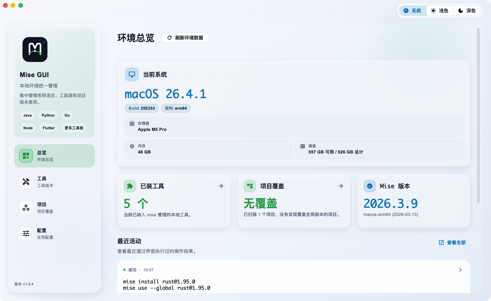
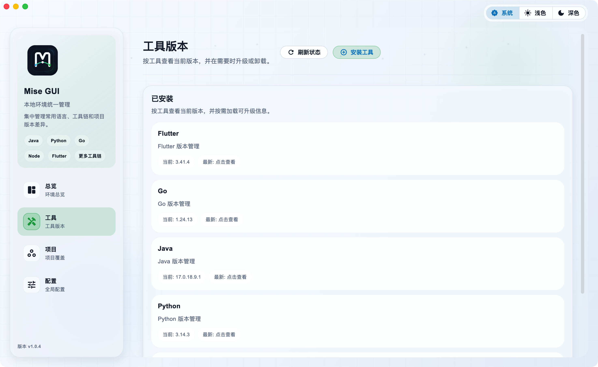
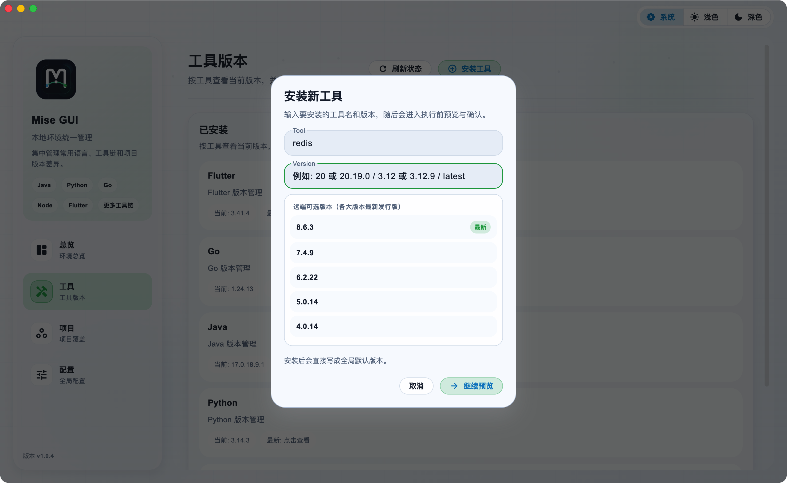
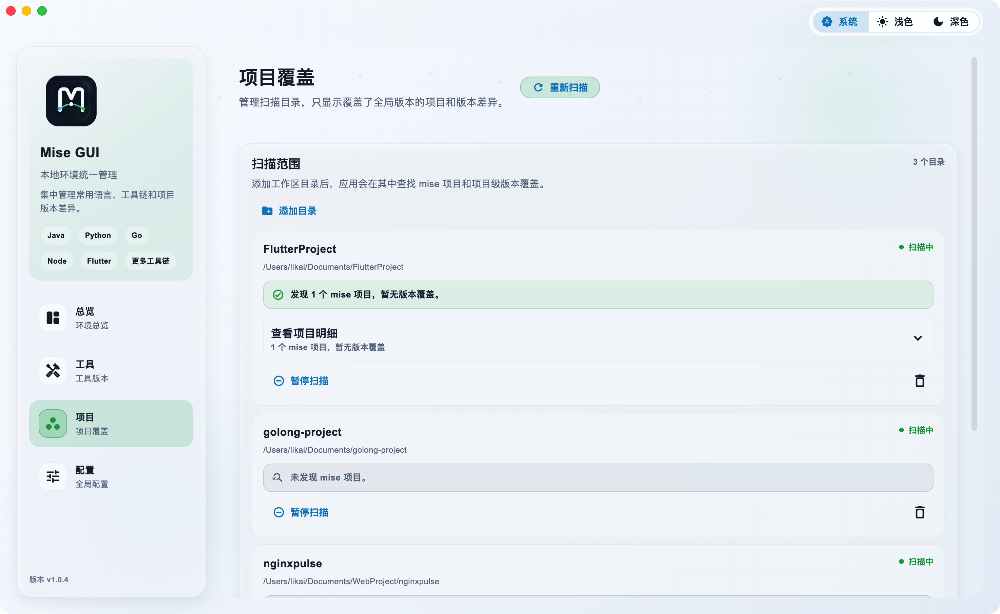
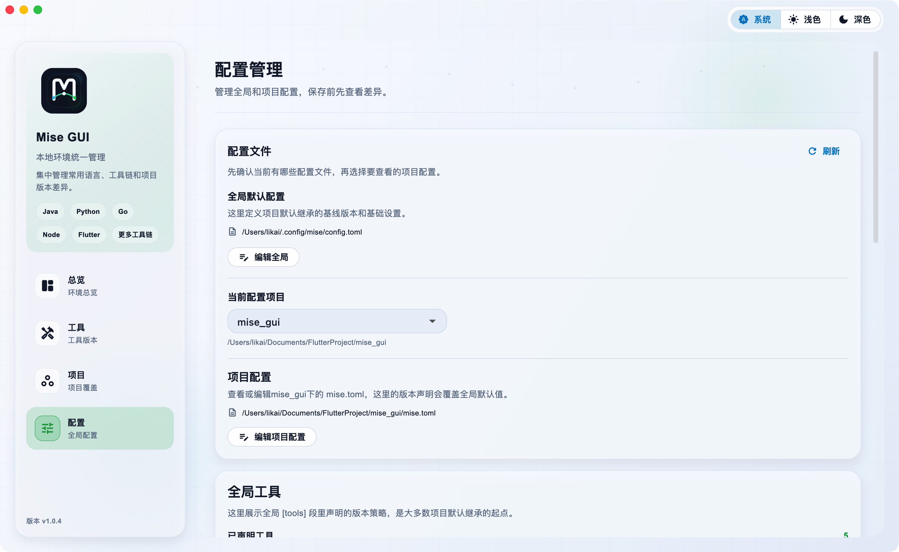

<p align="center">
  
</p>

<p align="center">
  <a href="README.md">简体中文</a> · English
</p>

<p align="center">
  <a href="https://github.com/likaia/mise_gui/releases"></a>
  <a href="https://github.com/likaia/mise_gui/releases"></a>
  <a href="LICENSE.txt"></a>
  <a href="https://github.com/likaia/mise_gui/releases"></a>
</p>

# Mise GUI

A visual mise management app for developers, designed to quickly manage local toolchain versions and project-level tool dependencies through a graphical interface.



## Overview

Mise GUI is a cross-platform Flutter desktop app that provides a more intuitive local environment management experience for [mise](https://mise.jdx.dev/). It reads real mise CLI state and brings system information, installed tools, project-level overrides, global configuration, and recent operations together for fast, convenient management.

This project is built for developers who frequently switch between multiple languages and projects. Instead of repeatedly running `mise current`, `mise ls`, `mise outdated`, or opening multiple `mise.toml` files, you can quickly see which projects currently override global versions.

## Screenshots

### Tool Versions

View current and latest versions by tool. Open details to load remote versions, switch versions, upgrade, or uninstall.



### Install a New Tool

The install flow loads remote candidate versions first, then moves into command preview before execution, so operations are never run invisibly.



### Project Coverage

Add multiple scan directories. The app recursively checks project configuration and highlights projects that override global defaults.



### Configuration Management

The configuration page keeps global and project configuration in the same context. TOML edits can be reviewed with a diff preview before saving, reducing the risk of accidental changes.



## Getting Started

Go to the [releases](https://github.com/likaia/mise_gui/releases) page and download the latest version for your operating system. After installation, if mise is not installed on the current machine, the app will enter the onboarding screen and show the recommended install command:

```bash
# macOS
brew install mise

# Windows
winget install jdx.mise

# Linux
curl https://mise.run | sh
```

## Local Development

```bash
git clone https://github.com/likaia/mise_gui.git
cd mise_gui

flutter pub get
flutter run -d macos
```

Use the matching desktop target on other platforms:

```bash
flutter run -d linux
flutter run -d windows
```

## Project Structure

```text
lib/
  app/                  # App bootstrap, routing, theme, and shell
  features/
    dashboard/          # Environment overview
    tools/              # Tool versions, install, upgrade, uninstall
    projects/           # Scan directories and project coverage
    config/             # Global and project configuration management
  repositories/         # Page-level data aggregation
  services/             # mise CLI, config, history, update, and low-level services
  shared/ui/            # Shared panels, states, dialogs, and preview components
scripts/                # macOS packaging scripts
docs/                   # README screenshot assets
```

## License

This project is licensed under the MIT License. See [LICENSE.txt](LICENSE.txt) for details.
